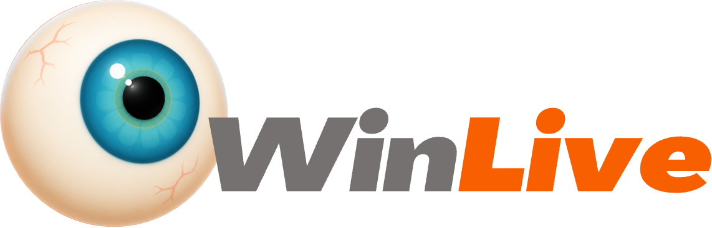
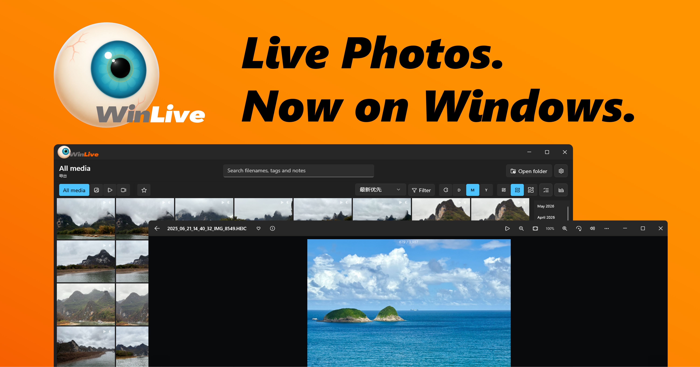

<div align="center">
  
  
  WinLive is a local photo library for Windows that supports HEIC+MOV Live Photos exported from iPhone and iPad.

  <p>
   <strong>English</strong> | <a href="README_zh.md">简体中文</a>
  </p>

  [](https://github.com/DevXDojo/WinLive/releases) [](LICENSE)
</div>

## 🚀 Quick Start

[](https://apps.microsoft.com/detail/9NXZW4PLMG80)



## 🛠️ Development

Install the .NET 8 SDK and the Windows App SDK workload, then run:

```powershell
dotnet restore WinLive.sln
dotnet test WinLive.sln
dotnet run --project .\src\WinLive\WinLive.csproj
```

The development command runs an unpackaged, self-contained executable directly and does not install anything. Run the following command only when you need to generate an MSIX package:

```powershell
dotnet build .\src\WinLive\WinLive.csproj -p:Platform=x64 -p:GenerateAppxPackageOnBuild=true
```

The verified development workflow signs the generated package with a local self-signed certificate after the build. Before installing the package, install `WinLive-Development.cer` into `Cert:\CurrentUser\TrustedPeople`.

## 🤝 Contributing

Contributions are welcome! See our [Contributing Guide](CONTRIBUTING.md) for details.

<details>

<summary>Click to expand the contribution guide</summary>

<div markdown="1">

Before contributing:

1. Read the [Code of Conduct](CODE_OF_CONDUCT.md)
2. Check existing issues or create a new issue
3. Fork the repository and create a feature branch
4. Make your changes and add tests
5. Submit a Pull Request

</div>

</details>

## 🔒 Security

If you discover a security vulnerability, please follow our [Security Policy](SECURITY.md).

## 📝 License

This project is licensed under GPL-3.0. See the [LICENSE](LICENSE) file for details.

WinLive distributions include dynamically linked libraries from the [FFmpeg](https://ffmpeg.org/) project. The current `FFmpeg.LGPL` package declares those libraries under LGPL-3.0-or-later; FFmpeg and its libraries remain the property of their respective copyright holders. See [FFmpeg License and Legal Considerations](https://ffmpeg.org/legal.html) for details.

## 📮 Contact and Support

- **Issues**: [GitHub Issues](https://github.com/DevXDojo/WinLive/issues)
- **Discussions**: [GitHub Discussions](https://github.com/DevXDojo/WinLive/discussions)
- **Repository**: [github.com/DevXDojo/WinLive](https://github.com/DevXDojo/WinLive)

<div align="center">
  
  <p>Made with ❤️ by the WinLive Team</p>
</div>
